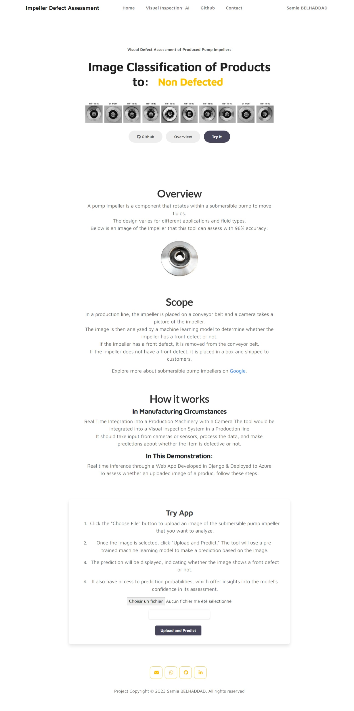

<h3 align="center" style=" line-height: 1.5;">The project is a Scalable Django Web App built for Computer Vision-Based Defect Assessment of Images of Pump Impellers. 
It provides an effective real-time inference solution for assessing product defects.
 
The full working django app can be accessed at <a >impellerdefectasssessment.azurewebsites.net</a></h3>

## Overview
This scalable Django-based application utilizes computer vision to provide real-time insights into the quality of pump impellers, empowering manufacturing  with a swift and accurate defect identification process.

* **Precision in Defect Detection**
  * The web app ensures that manufacturers can maintain and improve product quality by quickly identifying and rectifying defects in pump impellers.
  * Swift defect detection minimizes production downtime, preventing the delivery of subpar products and potential recalls.
 
* **Operational Efficiency**
* By automating the defect assessment process, manufacturers can streamline their operations, reducing manual inspection efforts and increasing overall efficiency.
* Efficient defect identification allows for targeted and resource-optimized maintenance and repair efforts.
* 
* **Data-Driven Decision Making**
* The application provides valuable insights into the types and frequency of defects, enabling businesses to make data-driven decisions for process improvement.
* The machine learning model can be continuously trained on new data, ensuring the system evolves and adapts to changing manufacturing conditions.
* 
## Key Features
* **Real-Time Defect Prediction**
  * **Effortless Assessment:** Users can upload images of pump impellers, and the system predicts whether the product is defective or defect-free in real-time.
  * **Enhanced Accuracy:** The underlying Convolutional Neural Network, trained and optimized using TensorFlow and Keras, ensures precise and reliable predictions.
* **Scalability with Django**
  * **Seamless Integration:** The Django backend seamlessly integrates the AI-based solution, providing a robust foundation for real-time defect assessment.
  * **User-Friendly Frontend:** The frontend is designed for a smooth user experience, making it easy for users to interact with the application.
* **Deployment on Azure**
* **Scalability and Reliability:** The final web application is deployed on Azure App Services, ensuring scalability and reliability.
* **Cloud-Based Storage:** Azure Blob storage is utilized to efficiently handle and store image data, contributing to the app's overall performance.
### Built with:

### Project Steps
- Process and Analyse Images of Submersible Pump Impellers.
- Train, Evaluate, and optimize a Convolutional Neural Network in Keras-Tensorflow for Binary Classification.
- Save the best model based on accuracy, recall, precision, and AUC ROC Curves.
- Build a Django Backend for real-time integration of the AI-Based Solution & Designed the FrontEnd
- Deployed the Web App to Azure Web App Services.

### Deployment

* The final web application was deployed on Azure App Services, ensuring scalability and reliability. 
* Azure Blob Containers are used for storing deep learning models and product images for seamless integration with the web application.

* Screenshot for the App:
  

### Setup to run 

* Clone Repository
* Navigate to directory
* Run in terminal
* Create Virtual Environemeent & Activate it
* Install requirements
~~~
pip install requirements.txt
~~~
* Run App
~~~
python manage.py runserver
~~~

## Contact
 Feel free to reach out to me on LinkedIn or through email & don't forget to visit my portfolio.
 

